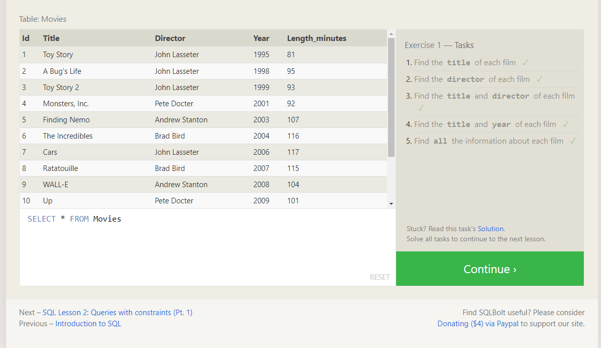
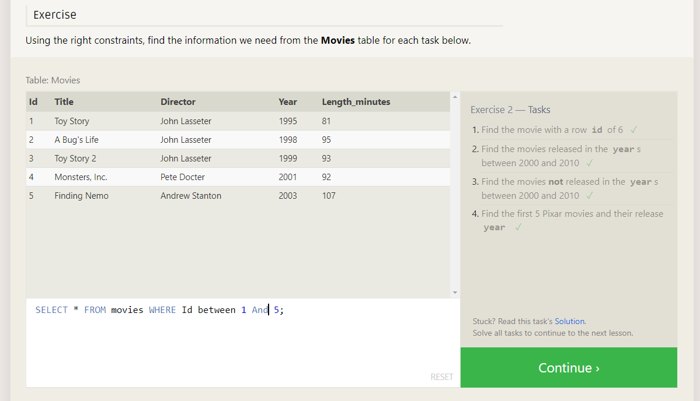
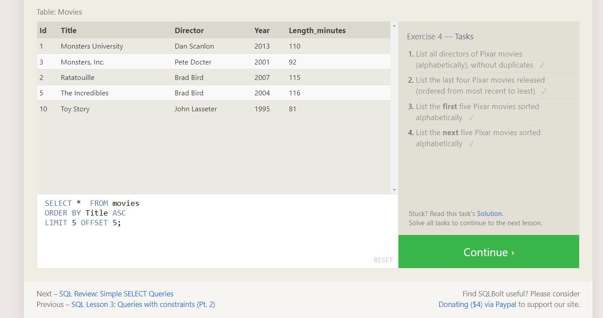
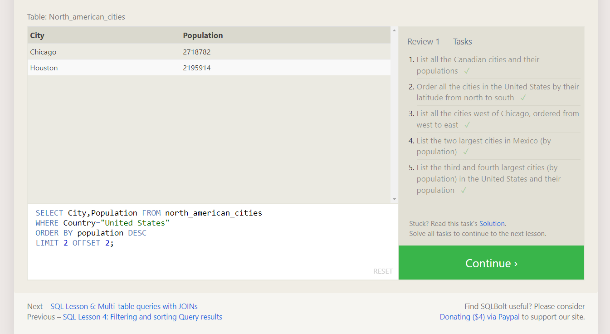
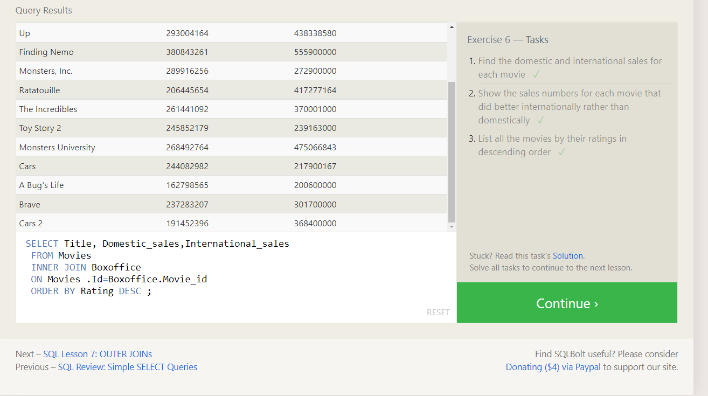
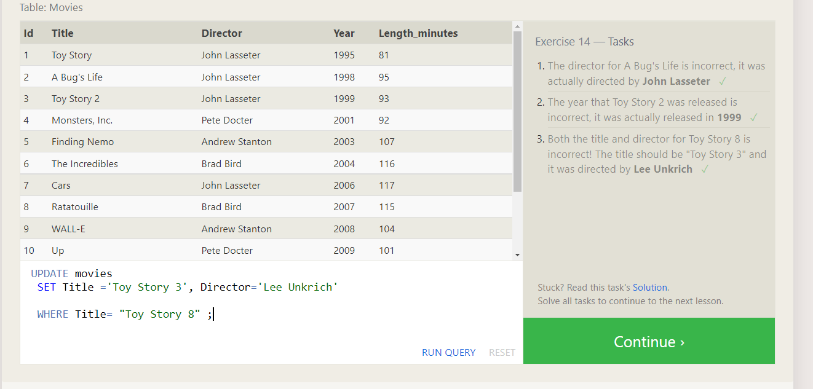
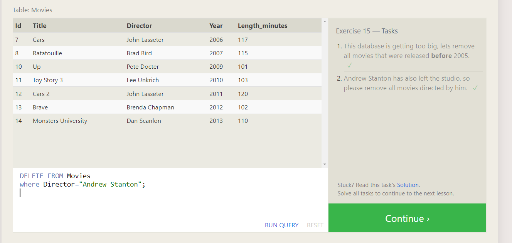
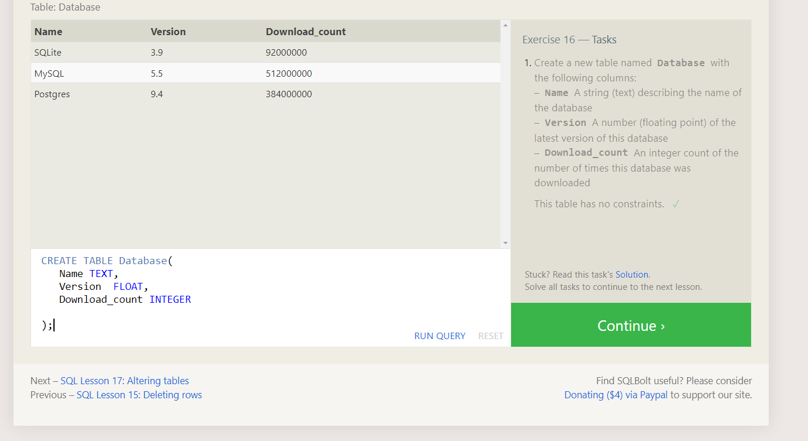

# **Introduction to SQL**

### It was a intersting to SQL in this ReadMe file I'm going to clear what we I have learned from "SQL Bolt tutorials" <br />

1 The defintion of SQL: s a standardized programming language that is used to manage relational databases and perform various operations on the data in them. <br />
1.1 In order to retrive data from database we have many option based on the perpose using SELECT
    examples: <br />
    1.1.1 In order to retrive Colomn: <br />
    ```SELECT column, another_column... From TableName```<br />
    1.1.2 In order to retrive the whole Table: ```SELECT * From TableName``` <br />
1.2 In order to retrive data with conditons data from database we can use WHERE<br />
    examples:<br />
    1.2.1 ```SELECT * From TableName WHERE List="LOL"(Condition)```<br />
    1.2.2 ```SELECT * From TableName WHERE List="LOL"(Condition) AND another Condition``` <br />
1.3 In order to retrive without duplicated rows: SELECT DISTINCT column <br />
1.4 Also we can use ``GROUP BY, ORDER BY`` <br />
Example: <br />
```(SELECT column, another_column, …``` <br />
```FROM mytable ``` <br />
```WHERE condition(s) ``` <br />
```ORDER BY column ASC/DESC;)```  <br /> 
1.4.1 iT's commonly used with the ORDER BY clause are the LIMIT and OFFSET clauses <br />
Eample: <br />
```(SELECT column, another_column, … ```<br />
```FROM mytable ```<br />
```WHERE condition(s) ```<br />
```ORDER BY column ASC/DESC ```<br />
```LIMIT num_limit OFFSET num_offset;)``` <br />

1.5 As we knew we commonly deal with multiple Tables, and we have a query called "JOIN"
and the first type of JOIN we gonna learn is "INNER JOIN", also we can combine 2 rows from 2 defferent tables with same key using "ON mytable.id = another_table.id" 

2-The defintion of Schema: It describes the structure of each table, and the datatypes that each column of the table can contain. <br />
2.1.1 In order to insert new Data into databse we will use "INSERT" <br />
  Exapmle: ```(INSERT INTO mytable VALUES (value))``` <br />
2.1.2 In somecases we have Incomplete data and the table contains columns that support default values <br />
so we have to insert rows with the specfic colomns <br /> 
  Exapmle:```` (INSERT INTO mytable ``` <br />
```(column, another_column,.....) VALUES (value_or_expr....))``` <br />
2.1.3 we have to make sure while adding Data that it's in the certain way based on the database. <br />

2.1 We can update rows in the Tables using the following query "UPDATE" <br />
   Example: ```(UPDATE mytable SET column = value)``` <br />
2.2 We can Delete rows in the Table using the following query "DELETE" <br />
   Eample: ```(DELETE FROM mytable WHERE condition;)```    <br />

2.3 Creating Tables: we can create new table into our databse using ```CREATE TABLE mytable``` <br />
2.3.1 As we knew before we have multiple data types so we have to define what's the type of column <br />
   Example: ( <br />
    ```CREATE TABLE movies``` ( <br />
  ```  id INTEGER PRIMARY KEY, ```
   ``` title TEXT,```
   ``` director TEXT,```
   ``` year INTEGER, ```
    ```length_minutes INTEGER```
);
   ) <br />
2.3.2 Adding column to the Table using the following:<br />
   Example: `ALTER TABLE mytable` <br />
`ADD column DataType OptionalTableConstraint `<br />
   ` DEFAULT default_value;) `<br />
2.3.3 Removing column to the Table using the following: <br />
   Example: `(ALTER TABLE mytable `<br />
`DROP column_to_be_deleted;)` <br />
2.3.4 Renaming column to the Table using the following: <br />
   Example: `(ALTER TABLE mytable` <br />
`RENAME TO new_table_name;) `<br />
2.3.5 we can delte Tables using the following: <br /> 
   Example: `(DROP TABLE IF EXISTS mytable;)` <br />


ScreenShots from each Exercise:  <br /> 











