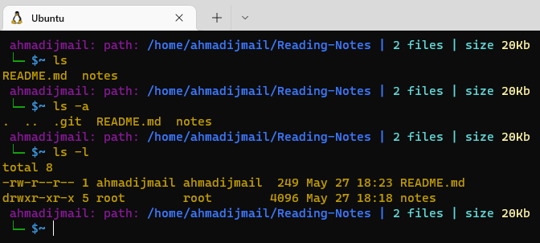
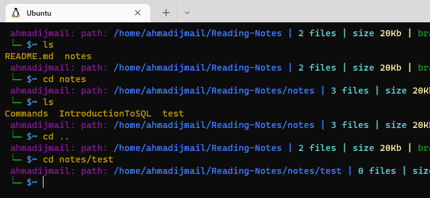
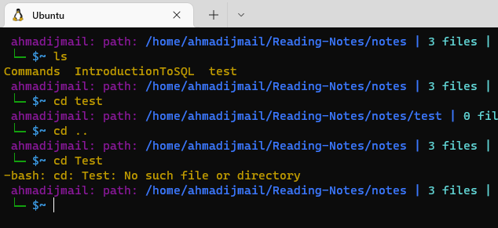
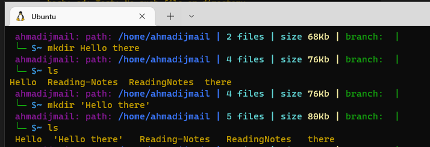
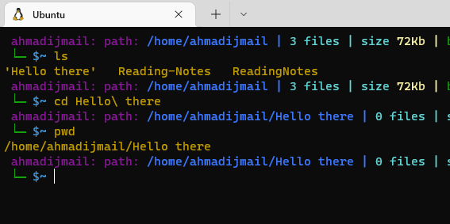
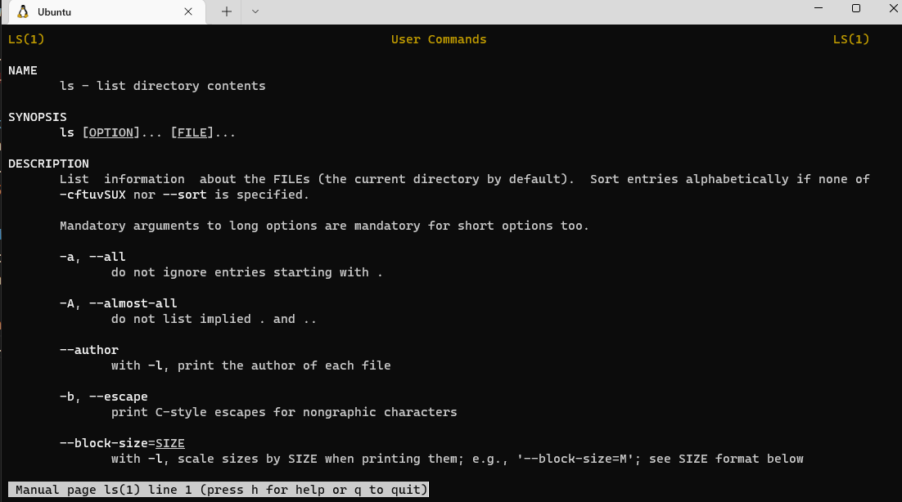

# The Command Line

Let's define what **command line** is: a command-line interface (CLI) to receive commands from a user in the form of lines of text. /

## **Basic Navigation** ##
We have multiple commands that allow us to navigate in the CLI 
1- ``` pwd ``` This will show where we are.
2-```ls``` OR ```ls -a``` It will show us what inside the directory we are in(-a to show hidden files).
 <br/>
3- moving between bathes can be done using <br> 
```cd Dirname``` To enter the Directory <br/>
```cd ..``` To get back to parent directory <br>
 <br/>

Quick Notice:
**Relative path** <br>
A file or directory location relative to where we currently are in the file system.<br>
**Absolute path**
A file or directory location in relation to the root of the file system.

## **More About Files** ##
As we know there's many type of files but with deferent extensions, like .txt .img .exe ....etc,
But linux somehow ignores the extensions and consider them as files for example if we have an IMG file with .txt extension Linux will treat it normally a IMG file <br>

**Linux** is Case Sensitive, so we should be curful while entering names or files or anything
Example: <br>



When we are dealing with a file that has a space in it's name we have to use Quotes.
Example: <br>  


**Backslash**  can be used to esacpe the special meaning of the next character. <br>
Example: <br>


## **Manual Pages** ##
It's the set of pages that explain every command available on your system including what they do.<br>
```man <command to look up>``` <br>
Example: 


In order to search within a specific manual page:<br> ```man -k <search term>``` <br>

In order to create a Directory: <br>
```mkdir name``` <br>
In order to remove an empty Directory:<br>
```rmdir name```<br>
```rm -rf name``` (for not empty Dir)<br> 
In order to Create a blank file:<br>
```touch name```<br>
In order to Copy a file or directory:<br>
```cp```<br>
In order to Move a file or directory:<br>
```mv```<br>

**Quick Notice**: <br>
Most commands have many useful CL options. Linuxs CL can't do undo feature.


