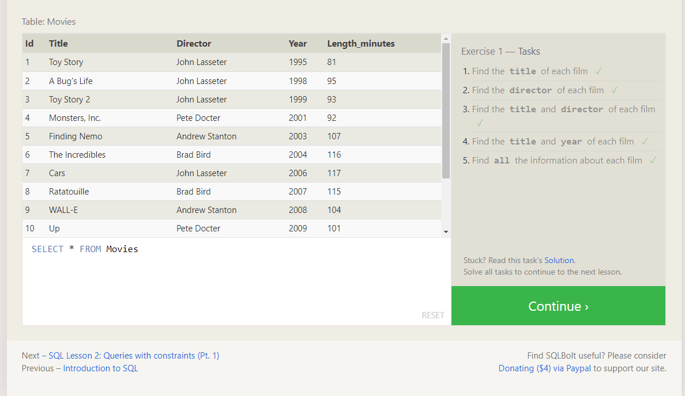
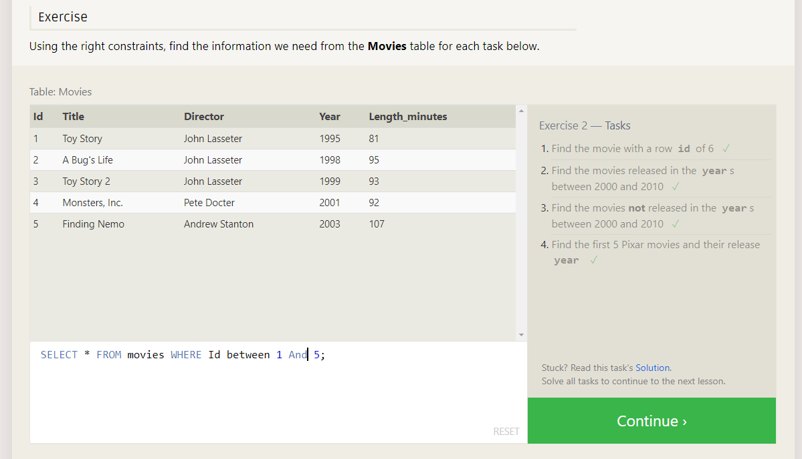
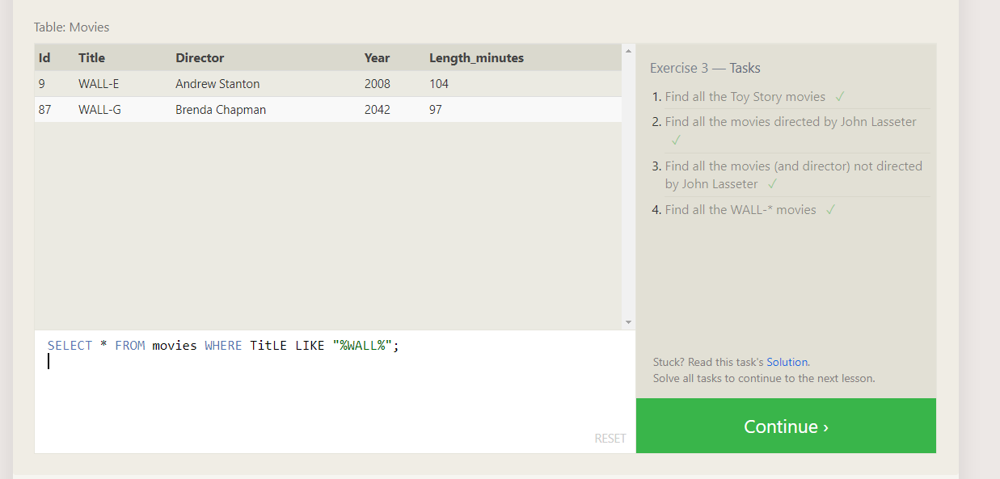
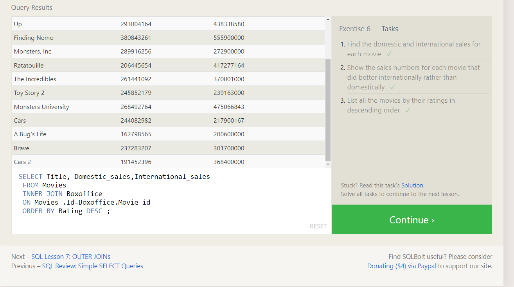
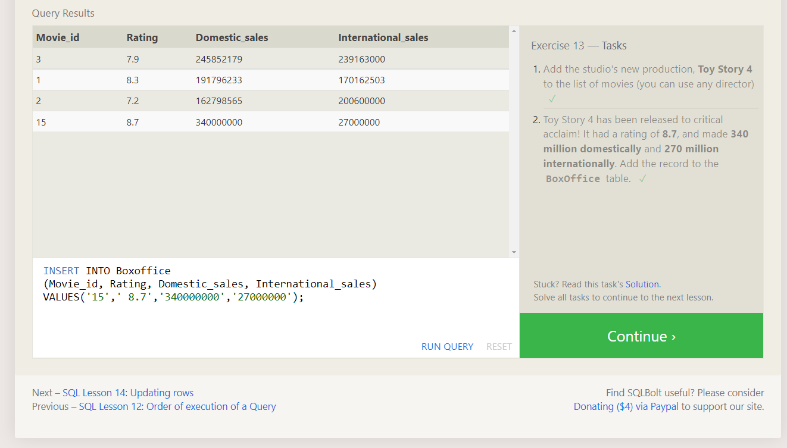
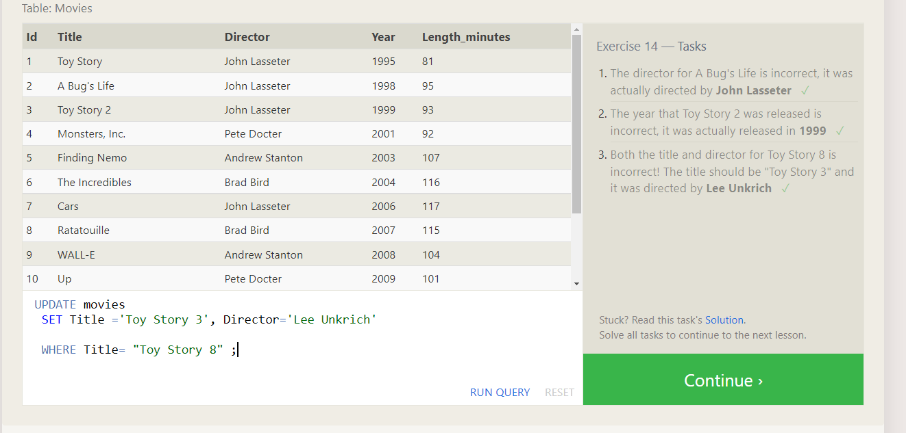
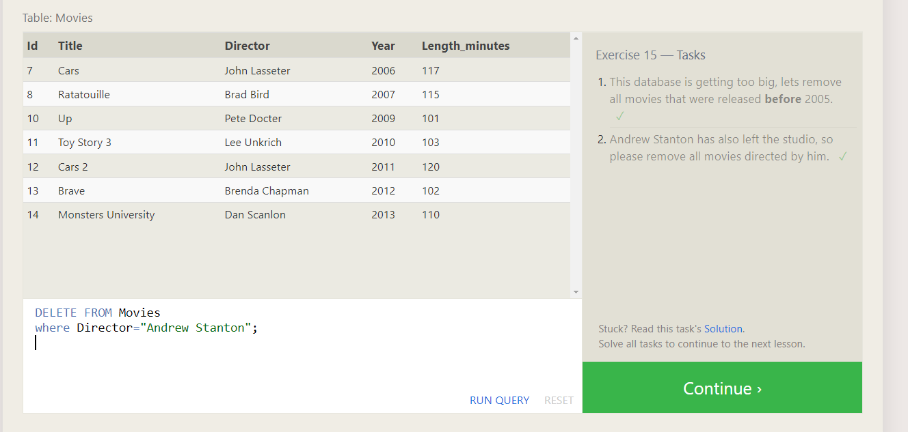
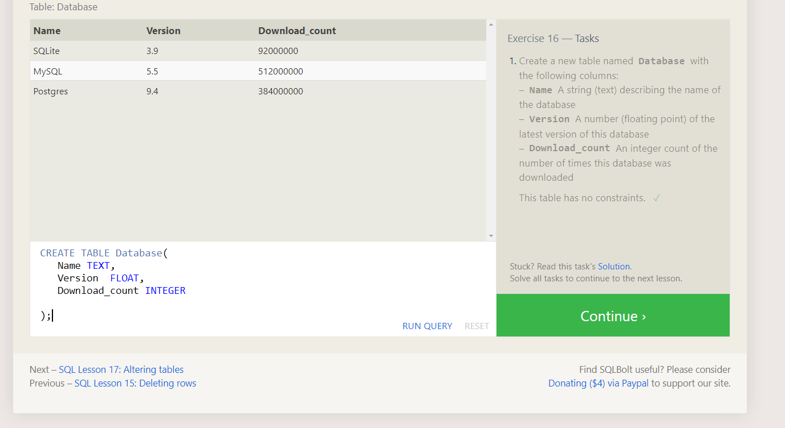
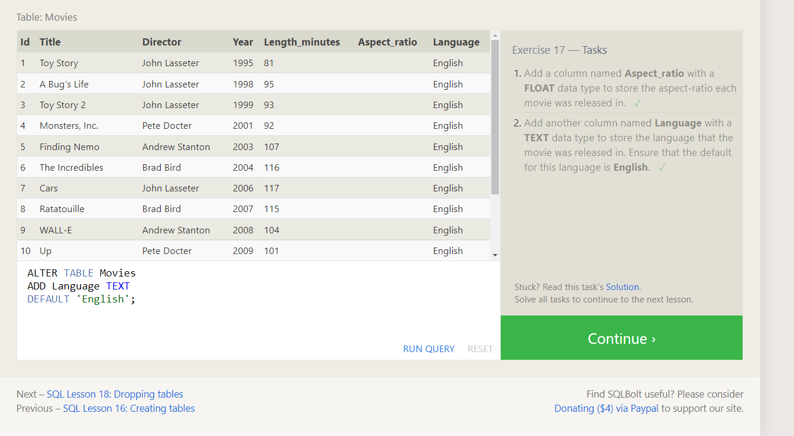

Introduction to SQL

It was a intersting to SQL in this ReadMe file I'm going to clear what we I have learned from "SQL Bolt tutorials"

1 The defintion of SQL: s a standardized programming language that is used to manage relational databases and perform various operations on the data in them. <br />
1.1 In order to retrive data from database we have many option based on the perpose using SELECT
    examples: <br />
    1.1.1 In order to retrive Colomn: <br />
    ```SELECT column, another_column... From TableName```<br />
    1.1.2 In order to retrive the whole Table: SELECT * From TableName <br />
1.2 In order to retrive data with conditons data from database we can use WHERE<br />
    examples:<br />
    1.2.1 SELECT * From TableName WHERE List="LOL"(Condition)<br />
    1.2.2 SELECT * From TableName WHERE List="LOL"(Condition) AND another Condition 
1.3 In order to retrive without duplicated rows: SELECT DISTINCT column
1.4 Also we can use GROUP BY, ORDER BY 
Example: 
(SELECT column, another_column, …
FROM mytable
WHERE condition(s)
ORDER BY column ASC/DESC;)  
1.4.1 iT's commonly used with the ORDER BY clause are the LIMIT and OFFSET clauses
Eample: 
(SELECT column, another_column, …
FROM mytable
WHERE condition(s)
ORDER BY column ASC/DESC
LIMIT num_limit OFFSET num_offset;)

1.5 As we knew we commonly deal with multiple Tables, and we have a query called "JOIN"
and the first type of JOIN we gonna learn is "INNER JOIN", also we can combine 2 rows from 2 defferent tables with same key using "ON mytable.id = another_table.id" 

2-The defintion of Schema: It describes the structure of each table, and the datatypes that each column of the table can contain. 
2.1.1 In order to insert new Data into databse we will use "INSERT"
  Exapmle: (INSERT INTO mytable VALUES (value))
2.1.2 In somecases we have Incomplete data and the table contains columns that support default values 
so we have to insert rows with the specfic colomns 
  Exapmle: (INSERT INTO mytable
(column, another_column,.....) VALUES (value_or_expr....))
2.1.3 we have to make sure while adding Data that it's in the certain way based on the database.

2.1 We can update rows in the Tables using the following query "UPDATE"
   Example: (UPDATE mytable SET column = value)
2.2 We can Delete rows in the Table using the following query "DELETE"
   Eample: (DELETE FROM mytable WHERE condition;)   

2.3 Creating Tables: we can create new table into our databse using "CREATE TABLE mytable"
2.3.1 As we knew before we have multiple data types so we have to define what's the type of column
   Example: (
       CREATE TABLE movies (
    id INTEGER PRIMARY KEY,
    title TEXT,
    director TEXT,
    year INTEGER, 
    length_minutes INTEGER
);
   ) 
2.3.2 Adding column to the Table using the following:
   Example: (ALTER TABLE mytable
ADD column DataType OptionalTableConstraint 
    DEFAULT default_value;)
2.3.3 Removing column to the Table using the following:
   Example: (ALTER TABLE mytable
DROP column_to_be_deleted;)
2.3.4 Renaming column to the Table using the following:
   Example: (ALTER TABLE mytable
RENAME TO new_table_name;)
2.3.5 we can delte Tables using the following:
   Example: (DROP TABLE IF EXISTS mytable;)


ScreenShots from each Exercise:   











